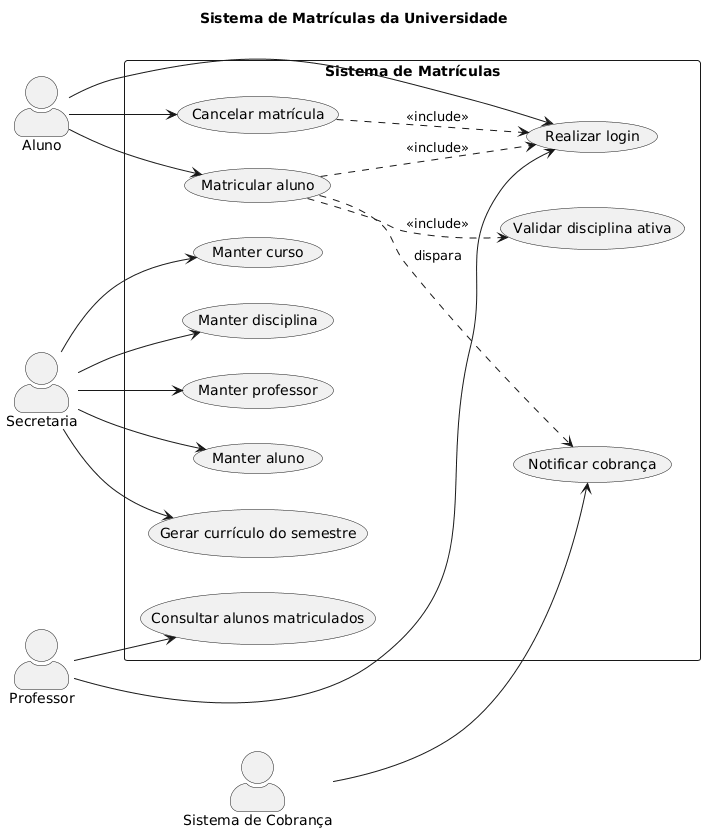

# Sistema de Matrículas da Universidade

## Visão geral
Este projeto tem como objetivo informatizar o processo de matrículas de uma universidade, automatizando o controle de alunos, cursos, disciplinas, professores e períodos letivos. A solução deve permitir que a secretaria mantenha o currículo do semestre, os alunos realizem matrículas e os professores acompanhem a turma de cada disciplina.

A Sprint 1 representa a etapa inicial do desenvolvimento, com foco na definição dos requisitos fundamentais do sistema de matrículas, incluindo autenticação, cadastro de dados acadêmicos e regras de negócio essenciais.

## Objetivo do projeto
Desenvolver um sistema que permita:
- manter informações sobre cursos, disciplinas, professores e alunos;
- gerar o currículo de cada semestre;
- permitir que o aluno faça matrículas dentro do período estabelecido;
- controlar o número máximo de vagas por disciplina;
- validar a ativação de disciplinas conforme o número mínimo de alunos;
- notificar o sistema de cobrança após a matrícula do semestre;
- permitir que professores consultem os alunos matriculados em sua disciplina;
- garantir autenticação com senha para todos os usuários.

## Diagrama da Sprint 1

## Sprint 1 - Histórias de Usuário

### 1. Cadastro e autenticação
- Como secretaria, quero manter os dados dos cursos, disciplinas, professores e alunos para organizar o currículo do semestre.
- Como usuário do sistema, quero realizar login com senha para acessar as funcionalidades permitidas ao meu perfil.

### 2. Matrícula de alunos
- Como aluno, quero me matricular em até 4 disciplinas como 1ª opção (obrigatórias) para cumprir meu currículo.
- Como aluno, quero escolher até 2 disciplinas alternativas (optativas) para completar minha matrícula quando necessário.
- Como aluno, quero cancelar matrículas já efetuadas durante o período de inscrição para ajustar minha escolha.

### 3. Regras de negócio da matrícula
- Como sistema, quero validar que uma disciplina só fica ativa no semestre seguinte se tiver pelo menos 3 alunos inscritos até o fim do período de matrículas.
- Como sistema, quero impedir que uma disciplina exceda o limite de 60 alunos matriculados.
- Como sistema, quero encerrar as inscrições de uma disciplina quando atingir a capacidade máxima de vagas.

### 4. Cobrança e acompanhamento
- Como sistema, quero notificar o sistema de cobranças após a matrícula do aluno no semestre para que a cobrança das disciplinas seja gerada.
- Como professor, quero visualizar os alunos matriculados em cada disciplina para acompanhar minha turma.

## Critérios de aceitação
- O sistema deve permitir login com usuário e senha válidos.
- A secretaria deve conseguir manter o currículo do semestre com disciplinas, professores e cursos.
- O aluno deve conseguir se matricular em até 4 disciplinas obrigatórias e 2 optativas.
- O aluno deve conseguir cancelar matrículas durante o período permitido.
- Uma disciplina só deve permanecer ativa se tiver pelo menos 3 alunos matriculados.
- Uma disciplina não deve receber mais de 60 alunos matriculados.
- O sistema deve avisar o setor de cobrança quando uma matrícula for confirmada.
- Os professores devem conseguir consultar os alunos de cada disciplina.
